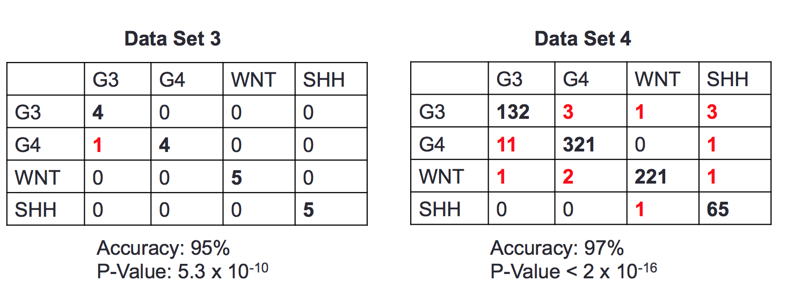

# MedulloClassifier

## Objective

The goal of this project is to develop a model/function that can accurately predict amongst 4 molecular subtypes of Medulloblastoma, Sonic Hedgehog (SHH), WNT, Group 3, and Group 4 from RNA-Seq or microarray data (and potentially any transcriptomic data). These subtypes were first identified using Non-negative matrix factorization on microarray data  (https://www.ncbi.nlm.nih.gov/pmc/articles/PMC4874239/). Since then, these subtypes are widely used in both research and clinical practice (https://www.ncbi.nlm.nih.gov/pmc/articles/PMC4105823/). It is important to note there are other studies that classify medulloblastoma's into many more subgroups(https://www.ncbi.nlm.nih.gov/pmc/articles/PMC6163053/). This classifier is not capable of that currently as we don't have adequete training data . 

## Method

The classifier was built using mulitiple microarray and RNA-Seq datasets. As there is tremendous variability in the dynamic range and values of microarray (between different platforms) and RNA-Seq, gene ratio's instead of gene expression were used as features for the model. Discrimanating features (gene ratios) were identified using the limma package (https://academic.oup.com/nar/article/43/7/e47/2414268) and samples are classified using an un-weighted sum of normalized scores.  The data was trained using 2 datasets and tested in 2 separate datasets. The classifier is still being refined but can currently differentiate between the 4 subtypes at a greater than 95% accuracy. 


## Results

The results reflect testing among 2 separate datasets although more independent datasets are needed and further refinement of the model is necessary. The overall trend is that the model/function can discern WNT and SHH very well but has a tougher time with Group 3 and Group 4 which may be expected as Group 3 and Group 4 are not characterized as well. 



## Steps to Install Package
To install the package inside RStudion console:
```
devtools::install_github("d3b-center/medullo-classifier-package")
```
\
To install the package from terminal, first clone the repository:
```
# HTTPS
git clone https://github.com/d3b-center/medullo-classifier-package.git

# SSH
git clone git@github.com:d3b-center/medullo-classifier-package.git
```
\
Next, use following command inside terminal:
```
R CMD INSTALL --no-multiarch --with-keep.source medullo-classifier-package
```

## Run
In order to run the package, you need two types of input:

	1. A dataframe of NxM dimension containing expression values. Rownames are HUGO/HGNC gene symbols and column names are Sample identifiers.
	2. A vector of length M containing Medulloblastoma subtypes corresponding to each sample identifier. Allowed values are G3, G4, SHH, WNT and U (for Unknown)


There are two functions to run:

	1. classify samples into medulloblastoma subtypes 
	predicted_classes <- classify(exprs = expression_matrix) 

	2. compute stats on accuracy
	accuracy <- calcStats(observed_classes, predicted_classes)

